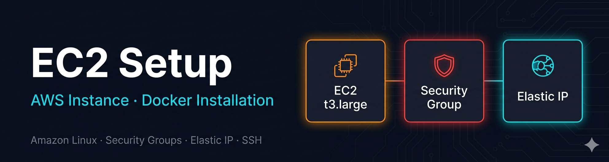

# 01 — EC2 Setup + Docker Installation

## Overview

Provision an AWS EC2 instance with a static Elastic IP, configure the Security Group firewall rules, and install Docker as the container runtime for the ELK stack.

---

## Step 1 — Launch EC2 Instance


Navigate to **EC2 → Launch Instance** in the AWS console.


Select **Amazon Linux** as the operating system.


Select `t3.large` — 2 vCPU and 8GB RAM, the minimum recommended to run the full ELK stack comfortably.

---

## Step 2 — SSH Key Pair


Create an RSA SSH key pair. The `.pem` file is downloaded locally and used for all subsequent SSH access. Keep this file secure — it cannot be regenerated.

---

## Step 3 — Storage


Assign **30GB** of storage. Elasticsearch requires significant disk space for index storage and segment merging.


Instance created and visible in the EC2 instances panel.

---

## Step 4 — Security Group Configuration


Configure inbound rules in the Security Group:

| Port | Protocol | Source | Purpose |
|---|---|---|---|
| 22 | TCP | My IP only | SSH access |
| 5601 | TCP | My IP | Kibana UI |
| 9200 | TCP | My IP | Elasticsearch REST API |
| 5044 | TCP | My IP | Logstash Beats input |

Restricting port 22 to a specific IP prevents brute force attacks from the public internet.

---

## Step 5 — Elastic IP (Static IP)


Allocate an **Elastic IP** and associate it with the EC2 instance. Without this, AWS assigns a new public IP on every instance restart — breaking SSH access and bookmarks.

---

## Step 6 — SSH Access + Docker Installation


```bash
ssh -i keypair.pem ec2-user@<ELASTIC_IP>
```

Once connected, install Docker:
```bash
sudo yum update
sudo yum install docker -y
sudo usermod -aG docker ec2-user
sudo systemctl enable docker.service
sudo systemctl start docker.service
```


Docker installed and confirmed running as a system service. The `usermod` command adds `ec2-user` to the docker group — avoiding the need for `sudo` on every docker command.
