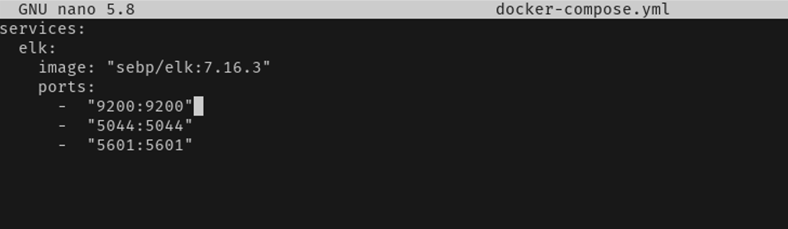
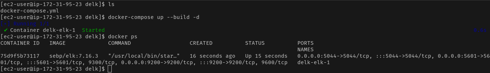
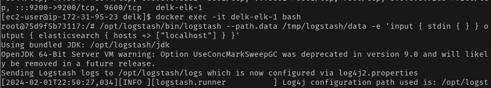
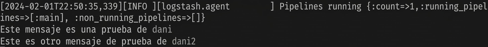
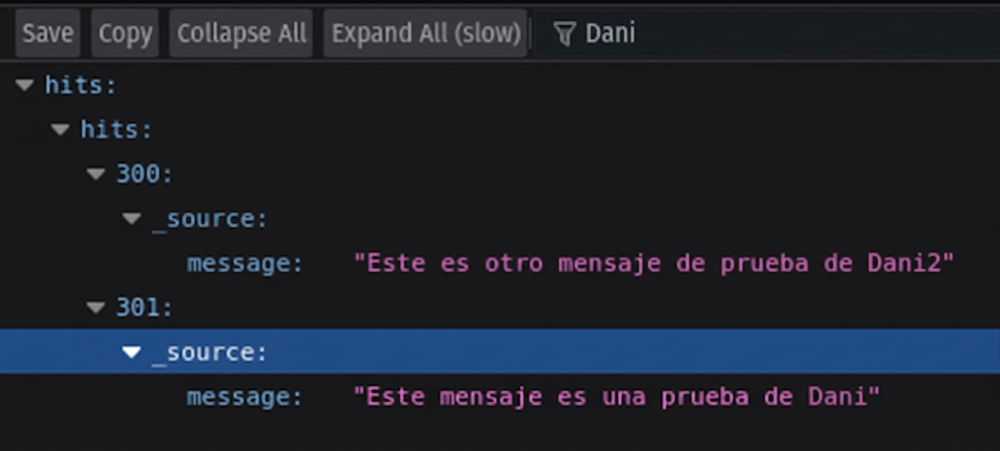
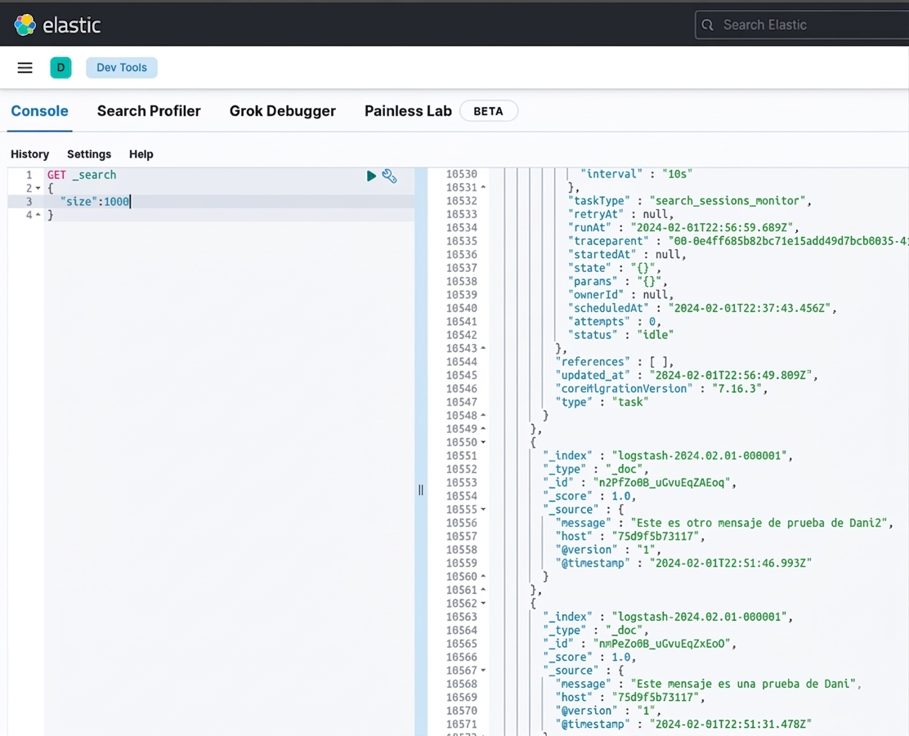

# 03 — Docker Compose + Logstash Ingestion

## Overview

Replace the manual `docker run` with a Docker Compose deployment for reproducibility, then ingest a test event through Logstash into Elasticsearch and verify it in Kibana.

---

## Step 1 — Deploy via Docker Compose

Remove the manual container and rebuild using Docker Compose:
```bash
docker rm -f elk
docker-compose up --build -d
```




`docker-compose.yml` defines the full ELK stack configuration declaratively — ports, volumes, environment variables and restart policies. This ensures consistent, reproducible deployments across environments.

---

## Step 2 — Ingest Test Message via Logstash

Open a shell inside the running ELK container:
```bash
docker exec -it elk bash
```

Start Logstash with a stdin input pipeline:
```bash
/opt/logstash/bin/logstash \
  --path.data /tmp/logstash/data \
  -e 'input { stdin { } } output { elasticsearch { hosts => ["localhost"] } }'
```



Wait for Logstash to finish initializing (the pipeline started message appears), then type the test message and press Enter:



Press `Ctrl+C` to flush the pipeline and send the event to Elasticsearch.

---

## Step 3 — Verify in Elasticsearch



Verify the event reached Elasticsearch via the REST API:
```bash
curl http://localhost:9200/_search?pretty
```

The test message appears in the response JSON confirming successful ingestion.

---

## Step 4 — Verify in Kibana



Event visible in **Kibana → Discover** with full metadata — timestamp, host, message field and Logstash pipeline tags.
