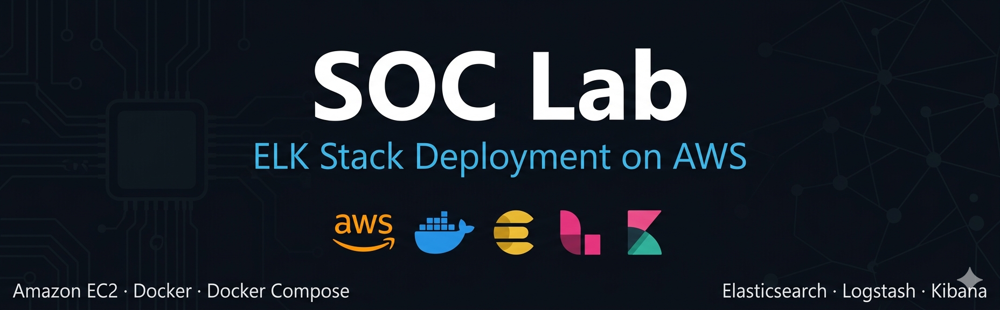
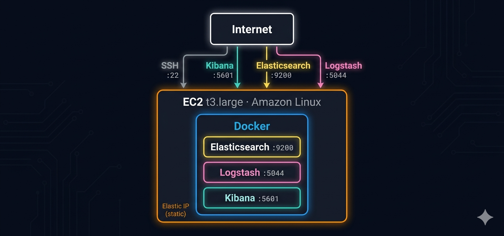
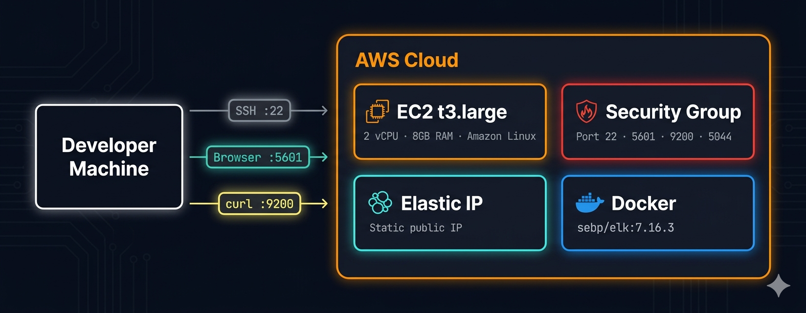

# SOC Lab — ELK Stack on AWS

## Overview

Deployment of a **Security Operations Center (SOC)** environment using the ELK Stack (Elasticsearch, Logstash, Kibana) on AWS EC2. The stack runs fully containerized via Docker and Docker Compose, with Logstash ingesting events into Elasticsearch and Kibana providing the visualization and analysis layer.

## Table of Contents

- [Architecture](#architecture)
- [Infrastructure](#infrastructure)
- [01 — EC2 Setup + Docker](./01-ec2-setup/)
- [02 — ELK Stack via Docker](./02-elk-docker/)
- [03 — ELK Stack via Docker Compose + Logstash](./03-elk-compose/)
- [04 — Kibana Index Pattern + Discover](./04-kibana-discover/)

---

## Architecture

The SOC environment is built on a single AWS EC2 instance running the full ELK stack inside a Docker container. All external traffic passes through a Security Group acting as a firewall — only the required ports are exposed and SSH access is restricted to the admin IP. The ELK container exposes three services: Elasticsearch as the data store, Logstash as the ingestion pipeline, and Kibana as the visualization and analysis frontend.

---

## Infrastructure

The infrastructure is intentionally minimal and cost-effective — a single `t3.large` instance provides enough CPU and RAM to run all three ELK services simultaneously. An Elastic IP ensures the public address remains stable across reboots. The Security Group enforces port-level access control, restricting each service to authorized sources only. Docker acts as the container runtime, isolating the ELK stack from the host OS and enabling a reproducible deployment via a single `docker run` or `docker-compose up` command.

| Component | Value |
|---|---|
| Cloud Provider | AWS |
| Instance Type | t3.large (2 vCPU · 8GB RAM) |
| OS | Amazon Linux |
| Storage | 30 GB |
| IP | Elastic IP (static) |
| ELK Image | sebp/elk:7.16.3 |
| Deployment | Docker · Docker Compose |

---

## What This Demonstrates

| Capability | Result |
|---|---|
| EC2 provisioning and hardening | ✅ |
| Security Group configuration | ✅ |
| Docker installation and management | ✅ |
| ELK Stack deployment via Docker | ✅ |
| ELK Stack deployment via Docker Compose | ✅ |
| Log ingestion via Logstash | ✅ |
| Data visualization in Kibana | ✅ |
| Index pattern creation and Discover | ✅ |
