# SOC Deployment with ELK Stack on AWS

## Overview

Deployment of a Security Operations Center (SOC) environment using the **ELK Stack** (Elasticsearch, Logstash, Kibana) on AWS EC2. The stack runs containerized via Docker and Docker Compose, with Logstash ingesting events into Elasticsearch and Kibana providing the visualization layer.

## Architecture
```
Internet
    │
    │  SSH (port 22 — restricted to admin IP)
    │  Kibana (port 5601)
    │  Elasticsearch (port 9200)
    │  Logstash (port 5044)
    ▼
EC2 t3.large (Amazon Linux)
Elastic IP (static)
    │
    └─ Docker
           └─ sebp/elk:7.16.3
                  ├─ Elasticsearch  :9200
                  ├─ Logstash       :5044
                  └─ Kibana         :5601
```

## Infrastructure

| Component | Value |
|---|---|
| Cloud Provider | AWS |
| Instance Type | t3.large (2 vCPU, 8GB RAM) |
| OS | Amazon Linux |
| Storage | 30 GB |
| IP | Elastic IP (static) |
| ELK Image | sebp/elk:7.16.3 |

---

## EC2 Setup + Docker Installation

### 1 — Launch EC2 Instance

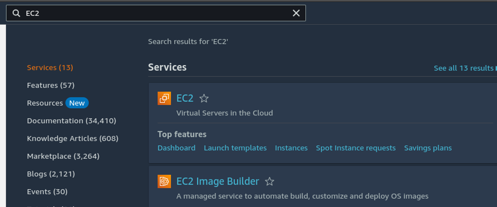
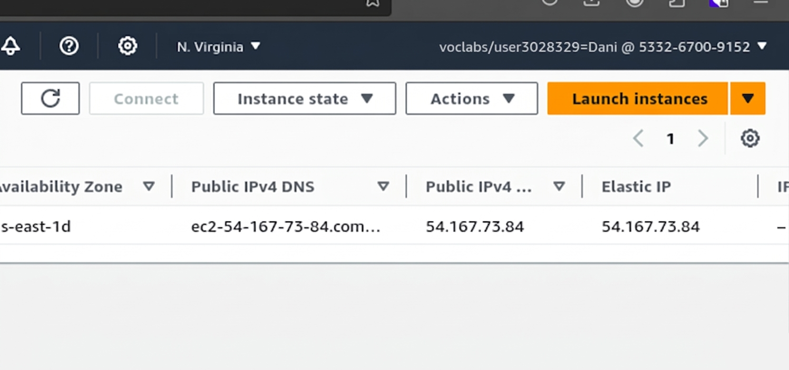

Navigate to EC2 → **Launch Instance** in the AWS console.

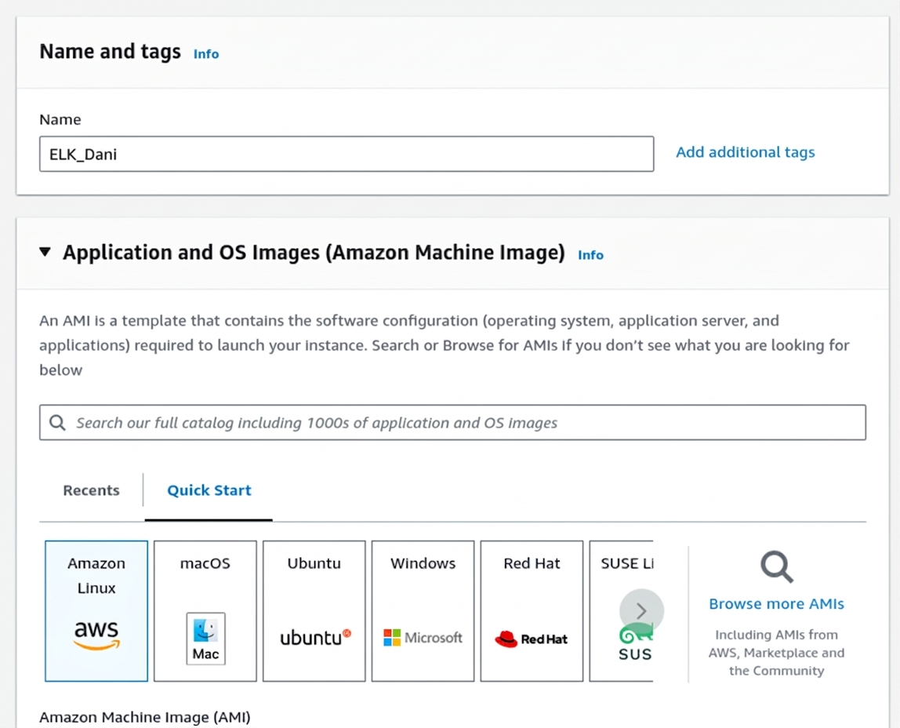

Select **Amazon Linux** as the operating system.

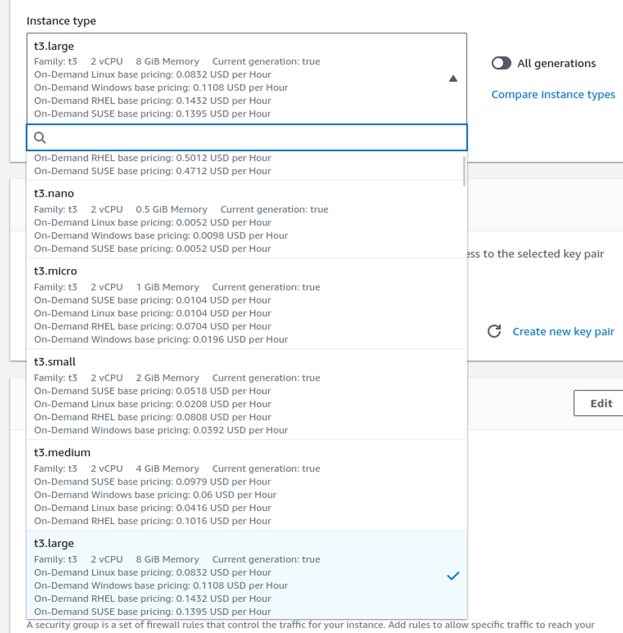

Select `t3.large` — 2 vCPU and 8GB RAM, sufficient to run the full ELK stack.

### 2 — SSH Key Pair

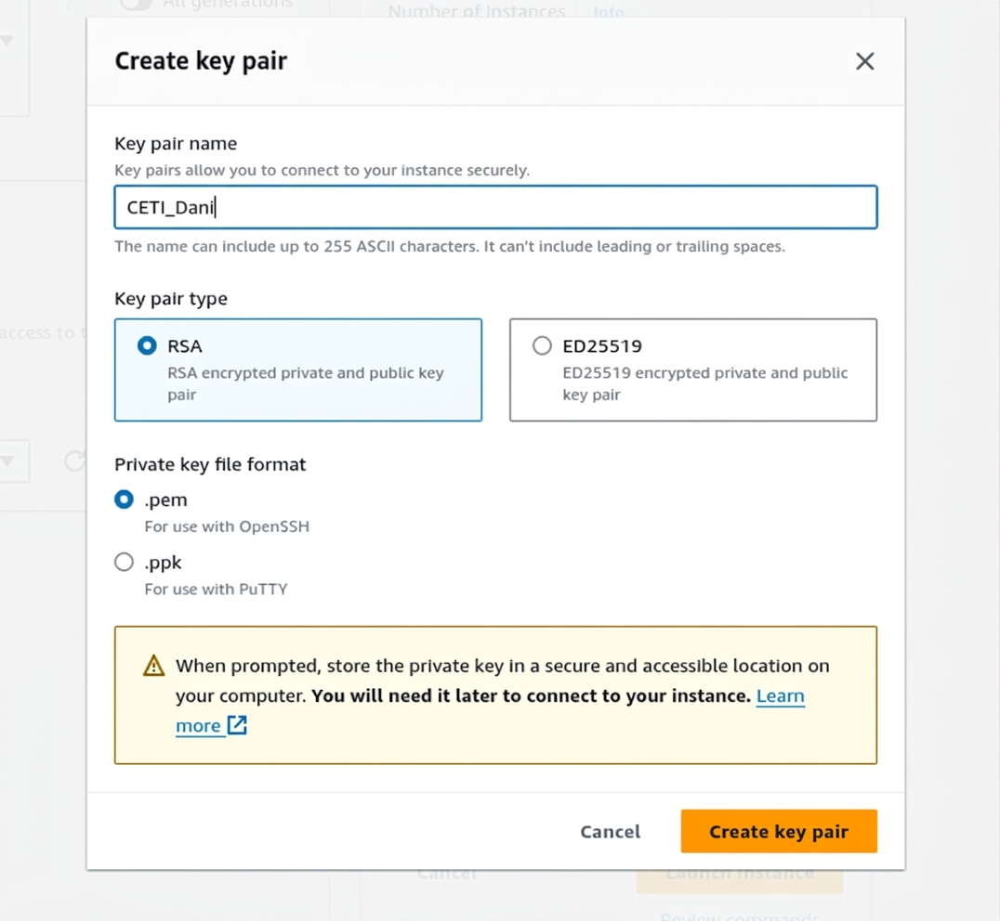

Create an RSA SSH key pair. The `.pem` file is downloaded and used for all subsequent SSH access.

### 3 — Storage

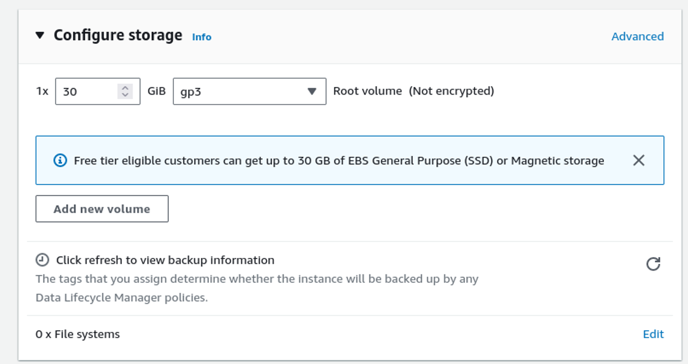

Assign 30GB of storage to the instance.


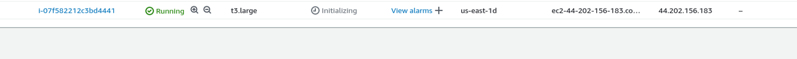

Instance created and visible in the EC2 instances panel.

### 4 — Security Group Configuration

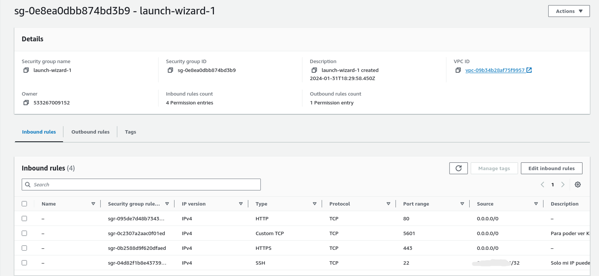
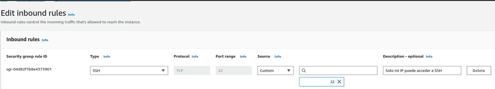
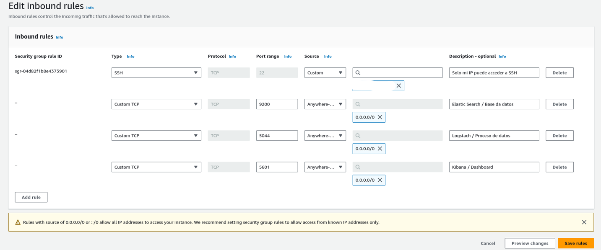

Configure inbound rules in the Security Group:

| Port | Protocol | Source | Purpose |
|---|---|---|---|
| 22 | TCP | My IP only | SSH access |
| 5601 | TCP | My IP | Kibana |
| 9200 | TCP | My IP | Elasticsearch API |
| 5044 | TCP | My IP | Logstash beats input |

Restricting SSH to a specific IP prevents brute force attacks from the public internet.

### 5 — Elastic IP (Static IP)

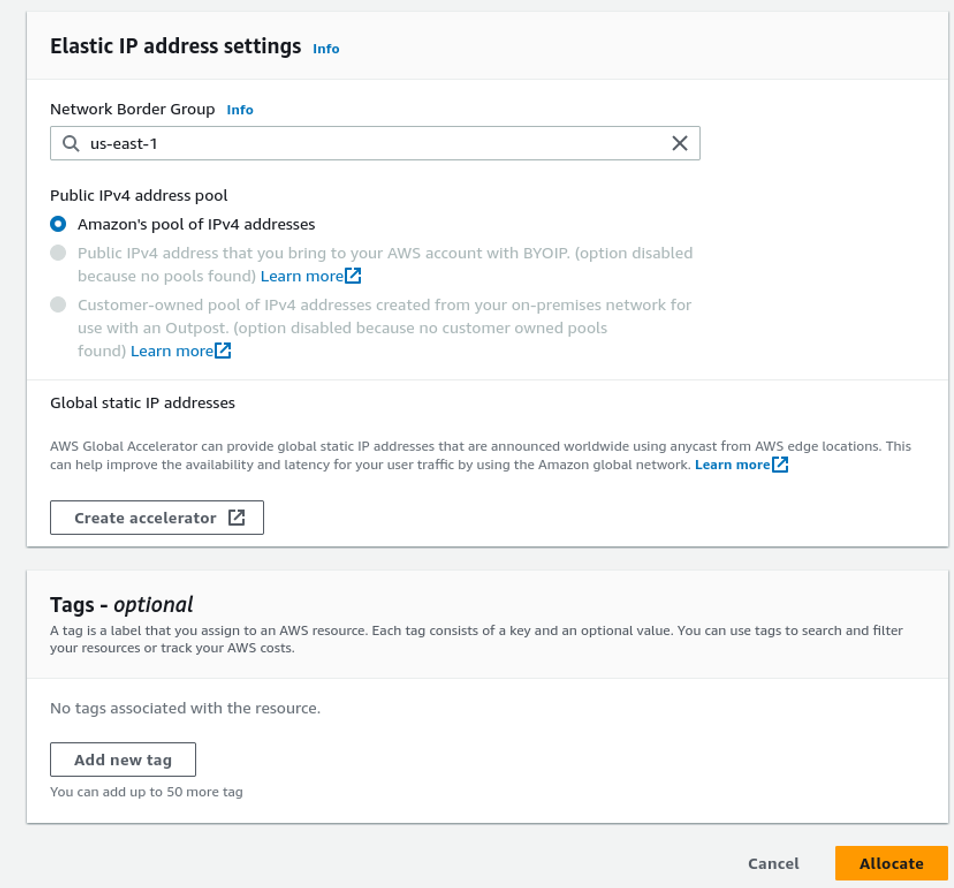
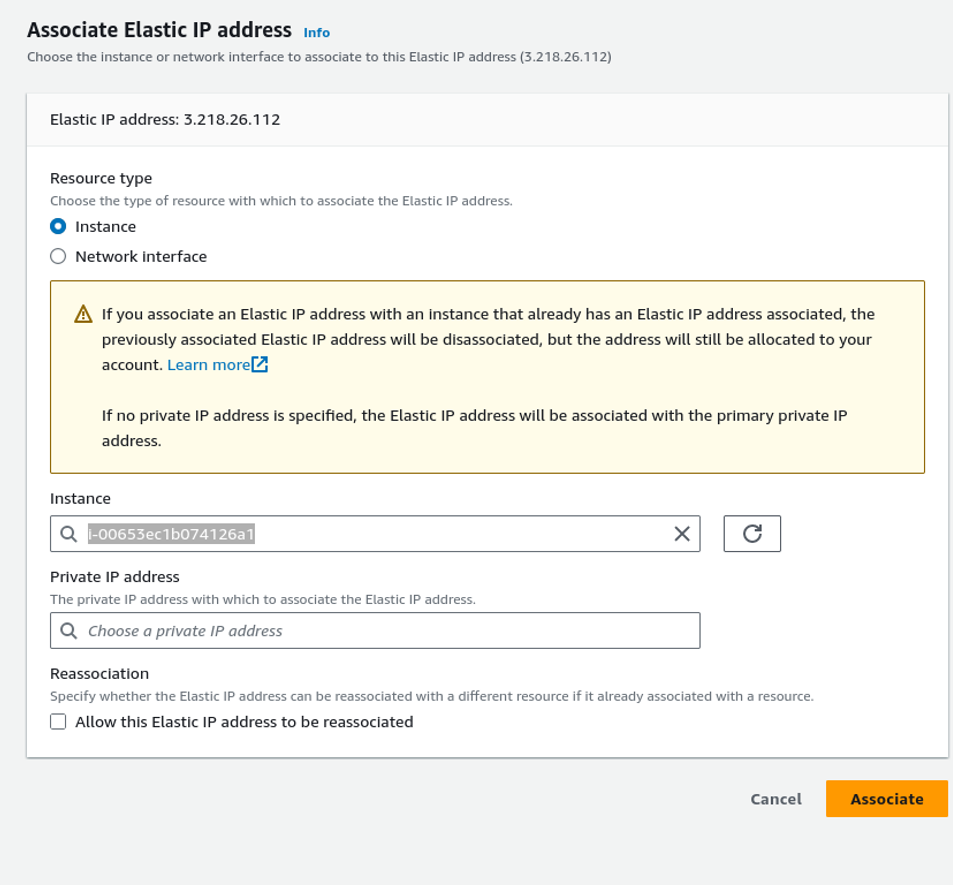
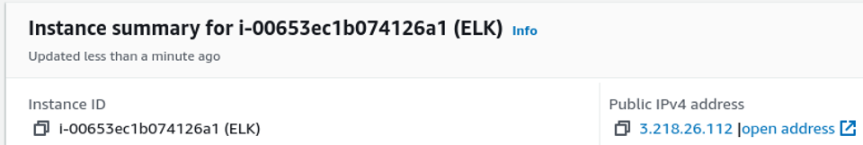

Allocate an Elastic IP and associate it with the EC2 instance. Without this, the public IP changes on every instance restart.

### 6 — SSH Access + Docker Installation

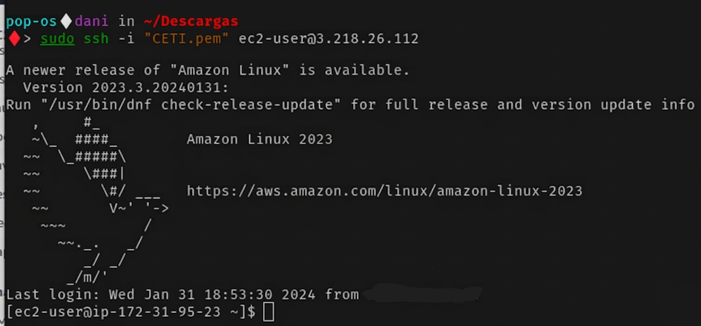
```bash
ssh -i keypair.pem ec2-user@<ELASTIC_IP>
```

Once connected, install Docker:
```bash
sudo yum update
sudo yum install docker -y
sudo usermod -aG docker ec2-user
sudo systemctl enable docker.service
sudo systemctl start docker.service
```

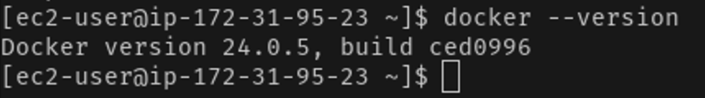

Docker installed and running as a system service.

---

## ELK Stack Deployment (Manual Docker Run)

### 7 — Deploy ELK Container

Before starting the container, increase the virtual memory limit required by Elasticsearch:
```bash
sudo sysctl -w vm.max_map_count=262144
echo "vm.max_map_count=262144" | sudo tee -a /etc/sysctl.conf
```

Pull and run the ELK image:
```bash
docker pull sebp/elk:7.16.3
docker run -p 5601:5601 -p 9200:9200 -p 5044:5044 \
  -it --name elk -d --hostname elk sebp/elk:7.16.3
```

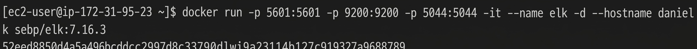

### 8 — Kibana Verification

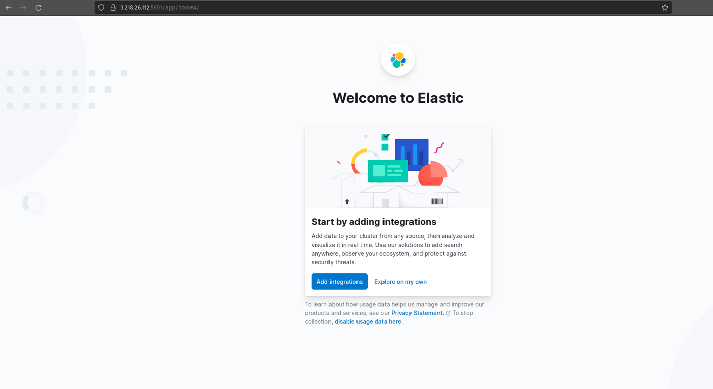

Kibana accessible at `http://<ELASTIC_IP>:5601` confirming the full ELK stack is running.

---

## Docker Compose + Logstash Ingestion

### 9 — Deploy via Docker Compose

Remove the manual container and rebuild using Docker Compose for a reproducible deployment:
```bash
docker rm -f elk
docker-compose up --build -d
```


`docker-compose.yml` defines the ELK stack configuration, ensuring consistent deployments.

### 10 — Ingest Test Message via Logstash

Open a shell in the running ELK container and start Logstash with a stdin input:
```bash
docker exec -it elk bash
/opt/logstash/bin/logstash \
  --path.data /tmp/logstash/data \
  -e 'input { stdin { } } output { elasticsearch { hosts => ["localhost"] } }'
```


Once Logstash finishes initializing, type the test message and press Enter:


Press `Ctrl+C` to flush and send the event to Elasticsearch.

### 11 — Verify in Elasticsearch and Kibana


Message visible via the Elasticsearch REST API at `http://<IP>:9200/_search`.


Message visible in **Kibana → Discover**.

---

## Index Pattern and Discover

### 12 — Create Index Pattern

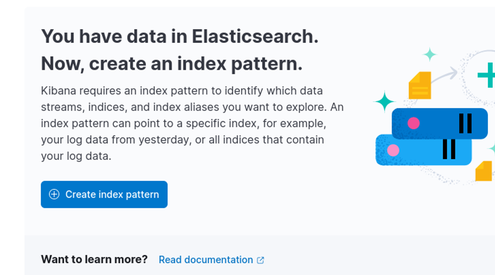

Navigate to **Kibana → Stack Management → Index Patterns**.

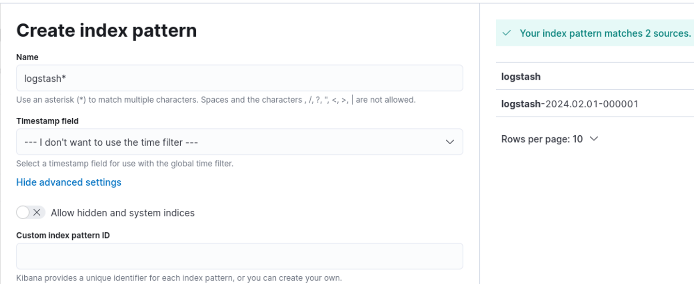

Create an index pattern targeting `logstash*` — this matches all indices created by Logstash regardless of date suffix.

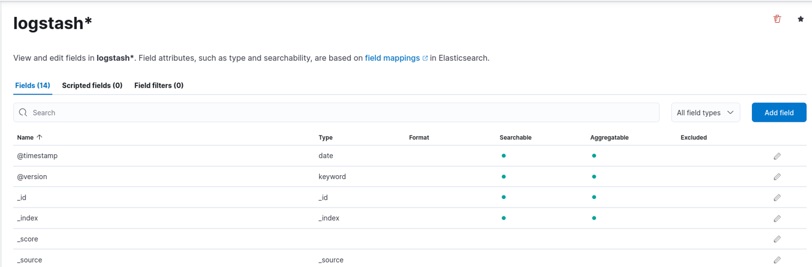

Configure timestamp field and confirm field list.

### 13 — Explore Data in Discover

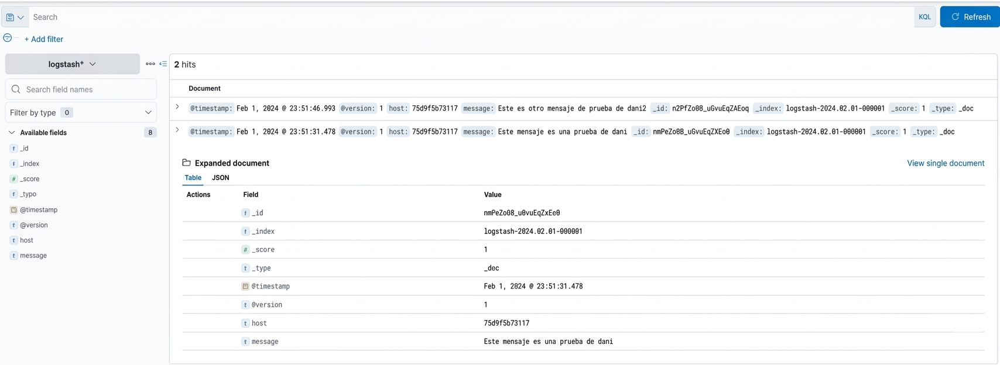

All ingested Logstash events are now visible in **Kibana → Discover** with full field breakdown, timestamps and filtering capabilities.

---

## Key Concepts

| Concept | Description |
|---|---|
| Elastic IP | Static public IP in AWS — survives instance restarts |
| Security Group | AWS firewall — inbound rules restricted to admin IP |
| vm.max_map_count | Kernel parameter required by Elasticsearch for memory mapping |
| Docker Compose | Declarative container orchestration — reproducible ELK deployment |
| Index Pattern | Kibana abstraction over Elasticsearch indices — enables Discover and dashboards |
| Logstash stdin | Quick ingestion method for testing the pipeline end-to-end |

## What This Demonstrates

| Capability | Result |
|---|---|
| EC2 provisioning and hardening | ✅ |
| Docker installation and management | ✅ |
| ELK Stack deployment via Docker | ✅ |
| ELK Stack deployment via Docker Compose | ✅ |
| Log ingestion via Logstash | ✅ |
| Data visualization in Kibana | ✅ |
| Index pattern creation | ✅ |
